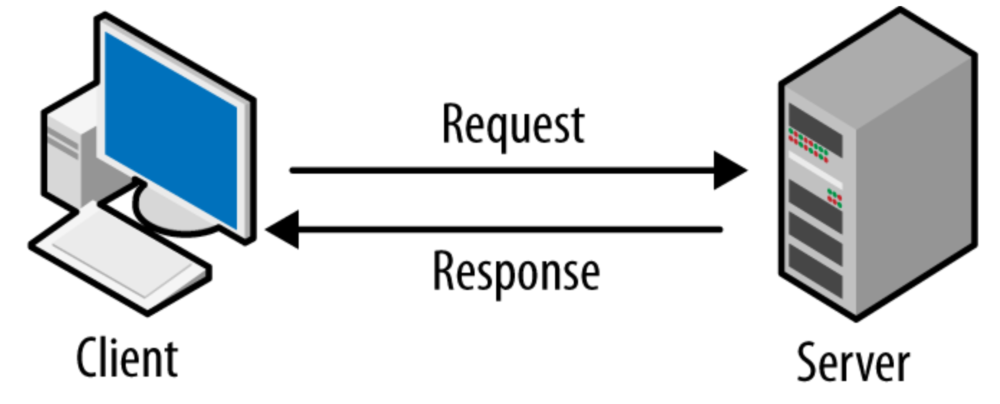
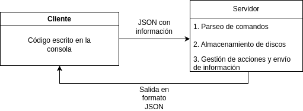

# Manual Técnico
### Manejo e Implementación de Archivos
### Proyecto 2 - Jorge Mejía 202300376


Este proyecto utiliza un sistema de archivos EXT2, simulando discos mediante archivos binarios. La estructura del sistema de archivos se divide en varias capas, cada una con su propia responsabilidad.

### División de Discos en Particiones

Los discos se dividen en particiones, que pueden ser primarias, extendidas o lógicas. Cada partición tiene su propio espacio en el disco y puede contener su propio sistema de archivos.

### Sistema de Archivos

Dentro de cada partición, el sistema de archivos se organiza utilizando un SuperBloque, inodos y bloques:

- **SuperBloque**: Contiene información global del sistema de archivos, como el número total de inodos y bloques, y los punteros a las tablas de inodos y bloques.
- **Inodos**: Cada inodo almacena información sobre un archivo o directorio, incluyendo su tamaño, permisos y punteros a los bloques de datos.
- **Bloques**: Los bloques contienen los datos reales de los archivos y directorios. Pueden ser bloques de datos, bloques de directorios o bloques de punteros.

Esta estructura permite una gestión eficiente del espacio en disco y facilita operaciones como la creación, lectura y escritura de archivos y directorios.

## Estructura de despliegue de la aplicación

El sistema está diseñado para ser desplegado en la nube de AWS, utilizando diferentes servicios para garantizar escalabilidad, disponibilidad y rendimiento. A continuación se detalla la estructura de despliegue:

### Backend en AWS EC2 con Docker

El backend está containerizado utilizando Docker para garantizar la consistencia entre ambientes de desarrollo y producción:

1. **Dockerización del backend**
   - El backend en Go se empaqueta en una imagen Docker usando un Dockerfile multietapa:
     ```dockerfile
     # Etapa de compilación
     FROM golang:1.21-alpine AS builder
     WORKDIR /app
     COPY go.mod go.sum ./
     RUN go mod download
     COPY . .
     RUN CGO_ENABLED=0 GOOS=linux go build -o main ./cmd/api

     # Etapa de ejecución
     FROM alpine:latest
     WORKDIR /app
     COPY --from=builder /app/main .
     EXPOSE 8080
     CMD ["./main"]
     ```
   - Este enfoque de construcción en múltiples etapas reduce el tamaño final de la imagen, mejorando la seguridad y velocidad de despliegue

2. **Despliegue en Amazon EC2**
   - La imagen Docker se despliega en una instancia EC2 de AWS, configurada con:
     - Un grupo de seguridad que permite el tráfico HTTP/HTTPS (puertos 80/443) y SSH (puerto 22)
     - Una IP elástica para garantizar que la dirección IP pública de la API permanezca constante
     - Un volumen EBS para persistir los datos de la aplicación (discos virtuales creados)

3. **Configuración de Docker en EC2**
   - La instancia EC2 ejecuta Docker y se configura para iniciar el contenedor automáticamente al reinicio:
     ```bash
     docker run -d --name backend-container -p 8080:8080 -v /datos_discos:/app/datos_discos --restart always simulador-backend
     ```
   - El volumen montado `-v /datos_discos:/app/datos_discos` permite persistir los archivos de disco entre reinicios del contenedor

### Frontend en Amazon S3

El frontend de NextJS se despliega como un sitio estático en un bucket S3:

1. **Generación de build estático**
   - Se genera una compilación estática del frontend usando NextJS:
     ```bash
     npm run build
     ```
   - Esta compilación produce archivos HTML, CSS y JavaScript optimizados en la carpeta `out/`

2. **Configuración del bucket S3**
   - Se crea un bucket S3 con la configuración para sitio web estático
   - Se habilitan las siguientes características:
     - Alojamiento de sitio web estático
     - Acceso público (configurado a través de una política de bucket)
     - Reglas CORS para permitir la comunicación segura con el backend

3. **Sincronización de archivos**
   - Los archivos compilados se suben al bucket S3:
     ```bash
     aws s3 sync out/ s3://nombre-del-bucket --delete
     ```
   - El parámetro `--delete` elimina los archivos que ya no están presentes en la compilación local

4. **Distribución mediante CloudFront (opcional)**
   - Para mejorar el rendimiento global, se puede configurar una distribución CloudFront:
     - Cache por tiempo de expiración (TTL) para archivos estáticos
     - HTTPS obligatorio con certificado SSL/TLS de AWS Certificate Manager
     - Compresión de contenido para archivos CSS, JS y HTML

### Comunicación entre Frontend y Backend

La comunicación entre ambas partes se realiza mediante API REST:

1. **Configuración CORS**
   - El backend implementa cabeceras CORS para permitir peticiones desde el dominio del frontend
   - En `main.go` se configura:
     ```go
     r.Use(cors.New(cors.Config{
         AllowOrigins:     []string{"*"},
         AllowMethods:     []string{"GET", "POST", "PUT", "DELETE", "OPTIONS"},
         AllowHeaders:     []string{"Origin", "Content-Type", "Accept", "Authorization"},
         ExposeHeaders:    []string{"Content-Length"},
         AllowCredentials: true,
     }))
     ```

2. **Variables de entorno en Frontend**
   - La URL del backend se define como variable de entorno en el frontend:
     ```
     API_URL=http://3.85.93.122:8080
     ```
   - Esto facilita el cambio entre entornos de desarrollo y producción

3. **Diagrama de arquitectura de despliegue**

   

## Estructura y conexión entre Frontend y Backend

En el proyecto, el Frontend está desarrollado con NextJS, que maneja la generación de páginas dinámicas y la interacción con el usuario.  
Por otro lado, el Backend se implementa en Go, empleando distintos singletons para simular la memoria RAM y mantener los datos en tiempo de ejecución.

1. El Frontend en NextJS realiza las peticiones mediante llamadas a APIs al servidor Go.  
2. El servidor Go recibe las solicitudes y las procesa usando las operaciones definidas (por ejemplo, creación de discos, manejo de particiones, o autenticación).  
3. Para simular la memoria en el servidor, se usan múltiples singletons que actúan como estructuras de almacenamiento temporal, manteniendo información como discos, particiones o usuarios mientras el sistema está en ejecución.  
4. El servidor responde con datos o confirmaciones de éxito/fallo, y NextJS los procesa para actualizar la UI.

Este enfoque facilita la escalabilidad, ya que el módulo de Go puede manejar la lógica del sistema de archivos y las operaciones principales, mientras que NextJS se encarga de la presentación y de ofrecer una experiencia de usuario interactiva.



Basando en el diagrama de flujo, se observa que el Frontend (NextJS) se comunica con el Backend (Go) a través de una API REST. En el cual la información se envía y recibe en formato JSON de esta forma:



## Estructura de backend

```
.
.
├── cmd
│   └── api
│       └── main.go
├── datos_discos
│   └── Disco1.mia
├── datos_jorgis
│   └── Calificacion_MIA
│       └── Discos
│           └── Disco1.mia
├── disk_registry.json
├── Dockerfile
├── entrada copy.txt
├── entrada.txt
├── go.mod
├── go.sum
├── internal
│   ├── args
│   │   └── args_split.go
│   ├── commands
│   │   ├── auth_commands.go
│   │   ├── disk_commands.go
│   │   └── partition_commands.go
│   ├── disk
│   │   ├── io
│   │   │   └── binary.go
│   │   ├── memory
│   │   │   └── storage.go
│   │   ├── operations
│   │   │   ├── auth
│   │   │   │   ├── change_group.go
│   │   │   │   ├── create_group.go
│   │   │   │   ├── create_user.go
│   │   │   │   ├── logged_user.go
│   │   │   │   ├── login.go
│   │   │   │   ├── logout.go
│   │   │   │   ├── remove_group.go
│   │   │   │   └── remove_user.go
│   │   │   ├── disk
│   │   │   │   ├── create_disk.go
│   │   │   │   ├── disk_registry.go
│   │   │   │   ├── list
│   │   │   │   ├── list_disks.go
│   │   │   │   ├── list_partitions.go
│   │   │   │   └── remove_disk.go
│   │   │   ├── ext2
│   │   │   ├── mbr
│   │   │   │   ├── create_mbr.go
│   │   │   │   ├── create_mbr_partition.go
│   │   │   │   └── find_extended.go
│   │   │   ├── partitions
│   │   │   │   ├── add_space_partition.go
│   │   │   │   ├── cat_file.go
│   │   │   │   ├── chmod.go
│   │   │   │   ├── chown.go
│   │   │   │   ├── copy.go
│   │   │   │   ├── create_directory.go
│   │   │   │   ├── create_file.go
│   │   │   │   ├── create_logical_partition.go
│   │   │   │   ├── create_partition.go
│   │   │   │   ├── delete_partition.go
│   │   │   │   ├── edit_file.go
│   │   │   │   ├── file_operations.go
│   │   │   │   ├── find_operation.go
│   │   │   │   ├── find_partition.go
│   │   │   │   ├── format_partition.go
│   │   │   │   ├── list_directory.go
│   │   │   │   ├── list_partitions.go
│   │   │   │   ├── loss_simulation.go
│   │   │   │   ├── mounted.go
│   │   │   │   ├── mount.go
│   │   │   │   ├── move.go
│   │   │   │   ├── recover_journaling.go
│   │   │   │   ├── remove_file_or_folder.go
│   │   │   │   └── rename.go
│   │   │   └── reports
│   │   │       ├── b_block_report.go
│   │   │       ├── b_inode_report.go
│   │   │       ├── block_report.go
│   │   │       ├── disk_report.go
│   │   │       ├── file_report.go
│   │   │       ├── inode_report.go
│   │   │       ├── journaling_report.go
│   │   │       ├── ls_report.go
│   │   │       ├── mbr_report.go
│   │   │       ├── super_block_report.go
│   │   │       └── tree_report.go
│   │   └── types
│   │       ├── fdisk.go
│   │       ├── mkdisk.go
│   │       └── structures
│   │           ├── authentication
│   │           │   ├── group.go
│   │           │   └── user.go
│   │           ├── ebr.go
│   │           ├── ext
│   │           │   ├── bitmap.go
│   │           │   ├── copy.go
│   │           │   ├── dir_block.go
│   │           │   ├── edit.go
│   │           │   ├── file_block.go
│   │           │   ├── generate_find_tree.go
│   │           │   ├── index_node.go
│   │           │   ├── journaling.go
│   │           │   ├── manager.go
│   │           │   ├── move.go
│   │           │   ├── pointer_block.go
│   │           │   ├── remove.go
│   │           │   ├── rename.go
│   │           │   └── super_block.go
│   │           ├── mbr.go
│   │           └── partition.go
│   ├── handlers
│   │   ├── directory_ls.go
│   │   ├── disks.go
│   │   ├── handlers.go
│   │   ├── journaling.go
│   │   ├── login.go
│   │   ├── logout.go
│   │   └── read_file.go
│   └── utils
│       └── path_utils.go
├── read.txt
├── requests
│   ├── directory.http
│   ├── login.http
│   └── logout.http
├── samples
│   ├── block_report.png
│   ├── block_report.png.dot
│   ├── inode.png
│   ├── inode.png.dot
│   ├── ls.png
│   ├── ls.png.dot
│   ├── output2.png
│   ├── output2.png.dot
│   ├── output2.txt
│   ├── output.png
│   ├── output.png.dot
│   └── output.txt
├── samplesblock_report.png
├── samplesblock_report.png.dot
├── test.txt
├── tmp
│   ├── build-errors.log
│   └── main
└── utils
    ├── convert_to_bytes.go
    ├── create_parent_dirs.go
    ├── find_group_in_file.go
    ├── find_last_group.go
    ├── find_last_user.go
    ├── find_user_in_file.go
    ├── first.go
    ├── format_time.go
    ├── get_file_names.go
    ├── get_parent_dirs.go
    ├── path.go
    ├── remove_element.go
    ├── replace_line.go
    └── slice.go
```

## Estructura de frontend

```
.
├── actions
│   ├── getJournaling.ts
│   ├── listDirectory.ts
│   ├── listDisks.ts
│   ├── listPartitions.ts
│   ├── login.ts
│   ├── logout.ts
│   ├── readFileContent.ts
│   └── sendCommand.ts
├── app
│   ├── favicon.ico
│   ├── globals.css
│   ├── layout.tsx
│   ├── page.tsx
│   ├── auth
│   │   └── page.tsx
│   └── manager
│       ├── layout.tsx
│       ├── disks
│       │   └── page.tsx
│       ├── files
│       │   └── page.tsx
│       ├── journaling
│       │   └── page.tsx
│       └── partitions
│           └── page.tsx
├── components
│   ├── CodeEditor.tsx
│   ├── Navbar.tsx
│   ├── atoms
│   │   ├── Button.tsx
│   │   ├── Card.tsx
│   │   ├── Input.tsx
│   │   └── ...
│   ├── molecules
│   │   ├── DiskCard.tsx
│   │   ├── FileCard.tsx
│   │   ├── FileViewer.tsx
│   │   ├── JournalingEntryCard.tsx
│   │   └── ...
│   ├── organisms
│   │   ├── DisksList.tsx
│   │   ├── FilesContainer.tsx
│   │   ├── JournalingList.tsx
│   │   └── ...
│   └── templates
│       ├── DisksPageTemplate.tsx
│       ├── FilesPageTemplate.tsx
│       └── ...
├── public
│   ├── file.svg
│   ├── fonts
│   ├── globe.svg
│   ├── next.svg
│   ├── vercel.svg
│   └── window.svg
├── types
│   ├── Disk.ts
│   ├── FileSystem.ts
│   └── Partition.ts
└── utils
    ├── editor-config.ts
    ├── formatBytes.ts
    └── operationStyles.ts
```

### Descripción de directorios y archivos clave

#### Actions
Este directorio contiene funciones que manejan la comunicación con el backend a través de llamadas a la API REST:

- **sendCommand.ts**: Envía comandos en formato texto al backend y recibe su resultado.
- **listDisks.ts**: Obtiene la lista de discos disponibles en el sistema.
- **listPartitions.ts**: Recupera las particiones de un disco específico.
- **listDirectory.ts**: Lista el contenido de un directorio en una partición montada.
- **readFileContent.ts**: Lee el contenido de un archivo en una partición montada.
- **getJournaling.ts**: Recupera las transacciones registradas en el journal de una partición.
- **login.ts**: Maneja la autenticación de usuarios en una partición.
- **logout.ts**: Cierra la sesión actual del usuario.

#### App
Contiene las páginas principales de la aplicación siguiendo la estructura de carpetas de Next.js:

- **page.tsx**: Página de inicio con el editor de comandos.
- **auth/page.tsx**: Página de autenticación para iniciar sesión.
- **manager/disks/page.tsx**: Visualizador y gestor de discos.
- **manager/partitions/page.tsx**: Visualizador y gestor de particiones.
- **manager/files/page.tsx**: Explorador de archivos y directorios.
- **manager/journaling/page.tsx**: Visualizador de transacciones del journal.

#### Components
Implementa la arquitectura de componentes siguiendo la metodología Atomic Design:

- **Atoms**: Componentes básicos como botones, entradas, tarjetas.
- **Molecules**: Componentes compuestos que combinan varios átomos.
- **Organisms**: Secciones completas de la interfaz que agrupan moléculas.
- **Templates**: Layouts predefinidos para diferentes tipos de páginas.
- **CodeEditor.tsx**: Editor interactivo para ingresar comandos con resaltado de sintaxis.
- **Navbar.tsx**: Barra de navegación principal de la aplicación.

#### Types
Define interfaces TypeScript para garantizar la tipificación estática:

- **Disk.ts**: Interfaces para discos y sus propiedades.
- **Partition.ts**: Interfaces para particiones y sus atributos.
- **FileSystem.ts**: Interfaces para archivos, directorios y sistemas de archivos.

#### Utils
Funciones de utilidad y configuraciones:

- **editor-config.ts**: Configuración del editor de código Monaco.
- **formatBytes.ts**: Funciones para formatear tamaños en bytes a formatos legibles.
- **operationStyles.ts**: Estilos y colores para diferentes tipos de operaciones.

### Sistema de Visor de Archivos

El explorador y visor de archivos es una parte fundamental del frontend que permite navegar por el sistema de archivos y visualizar contenidos. Está compuesto por varios componentes que trabajan en conjunto:

#### Arquitectura del Visor de Archivos

1. **Explorador de Archivos (FilesContainer.tsx)**
   - Presenta el contenido de un directorio en dos vistas posibles:
     - Vista de cuadrícula (Grid): Muestra archivos y directorios como tarjetas con íconos.
     - Vista de lista (List): Muestra archivos y directorios en formato tabla con detalles.
   - Implementa navegación tipo breadcrumb que permite regresar a directorios superiores.
   - Utiliza componentes FileCard para representar cada archivo o directorio.

2. **Visor de Contenido (FileViewer.tsx)**
   - Muestra el contenido de archivos de texto con formato y sintaxis resaltada.
   - Detecta automáticamente el tipo de contenido y ajusta la visualización.
   - Características principales:
     - Resaltado de sintaxis para tipos de archivo comunes (JSON, XML, texto plano).
     - Visualización en modo de solo lectura para prevenir cambios accidentales.
     - Controles para cerrar, descargar o copiar el contenido del archivo.
     - Muestra metadatos del archivo como tamaño, permisos y fechas de modificación.

3. **Integración con el Journaling**
   - El visor de archivos se integra con el sistema de journaling a través de:
     - Control de acceso basado en permisos del usuario actual.
     - Registro automático de operaciones de lectura en el journal.
     - Verificación de integridad del archivo antes de mostrar su contenido.

4. **Flujo de trabajo para visualización de archivos**
   - El usuario navega por el explorador de archivos hasta encontrar el archivo deseado.
   - Al hacer clic en un archivo, el sistema:
     1. Verifica los permisos del usuario para acceder al archivo.
     2. Realiza una solicitud al backend mediante la función readFileContent.
     3. Procesa la respuesta para determinar el tipo de contenido.
     4. Renderiza el contenido en el visor apropiado.
     5. Registra la operación en el journaling si corresponde.

5. **Componentes específicos para manejo de archivos**
   - **FileCard.tsx**: Representa visualmente un archivo o directorio con iconos apropiados.
   - **FileDetails.tsx**: Muestra metadatos detallados del archivo seleccionado.
   - **FileActionsMenu.tsx**: Proporciona opciones contextuales según el tipo de archivo.
   - **PathNavigator.tsx**: Implementa la navegación por rutas tipo breadcrumb.
   - **ViewModeSwitcher.tsx**: Permite cambiar entre vista de cuadrícula y lista.

El visor de archivos se comunica con el backend a través de las funciones definidas en `actions/readFileContent.ts` y `actions/listDirectory.ts`, que realizan solicitudes HTTP GET a los endpoints correspondientes. Las respuestas se procesan y se muestran en la interfaz utilizando los componentes descritos anteriormente.

Este diseño modular permite una clara separación de responsabilidades y facilita la extensión de funcionalidades sin afectar otros componentes del sistema.

### Descripción de archivos


### Descripción de directorios
- cmd/api: contiene el entry point principal del servidor.  
- internal/args: maneja la lógica para separar y procesar argumentos de línea de comandos.  
- internal/commands: define los comandos principales (disk, partition, auth) utilizando cobra.  
- internal/disk: almacena la lógica de lectura/escritura de datos, la simulación de memoria y la creación de reportes.  
- internal/handlers: agrupa funciones que se encargan de manejar peticiones HTTP y coordinan entre comandos.  
- utils: contiene utilidades auxiliares para tareas como formateo de datos, lectura de archivos y rutas.

## Sistema de comandos


El sistema utiliza la biblioteca "cobra" para definir y manejar los comandos. Al ingresar un comando, se sigue el siguiente proceso:

1. La cadena del comando se separa en tokens (argumentos) utilizando el método "SplitArgs".  
2. Dependiendo del prefijo (por ejemplo, "disk", "partition" o "auth"), el comando se deriva a la función correspondiente (ParseDiskCommand, ParsePartitionCommand o ParseAuthCommand).  
3. Cada función de parseo configura los argumentos de cobra, define flags (parámetros como --size, --path, etc.) y ejecuta el comando.  
4. Si hay argumentos desconocidos o se producen errores al procesar flags o parámetros, cobra genera el error correspondiente, interrumpiendo la ejecución.  
5. Finalmente, se muestra el resultado de la ejecución o el error en la salida estándar.


## Estructuras de datos

### MBR (Master Boot Record)
El MBR almacena información general del disco, incluyendo:  
• Tamaño total del disco (mbr_size)  
• Fecha de creación (mbr_creation_date)  
• Firma del disco (mbr_disk_signature)  
• Tipo de ajuste (mbr_disk_fit)  
• Hasta cuatro particiones (mbr_partitions)

### EBR
El EBR (Extended Boot Record) describe las particiones lógicas dentro de una partitura extendida. Incluye información sobre:
• Estado de montaje  
• Tipo de ajuste (fit)  
• Posición de inicio de la partición  
• Tamaño de la partición  
• Apuntador al siguiente EBR (en caso de más particiones lógicas)  
• Nombre de la partición

### Particiones
Cada partición contiene:  
• Nombre, tamaño y tipo de ajuste (fit)  
• Tipo: Primaria (P), Extendida (E) o Lógica (L)  
• Tamaño de la partición y posición en el disco

### SuperBloque
El SuperBloque guarda información global del sistema de archivos EXT2:  
• Cantidad total de inodos y bloques  
• Cantidad de inodos y bloques libres  
• Tamaño de cada inodo y bloque  
• Punteros al inicio de la tabla de inodos y bloques  
• Fecha de montaje y desmontaje

### Inodos
Cada inodo salva datos de archivos o directorios:  
• Dueño y grupo (UID y GID)  
• Tamaño, fechas de acceso/creación/modificación  
• Punteros a bloques (12 directos, 3 indirectos)  
• Permisos y tipo de archivo (carpeta o archivo)

### Bloques
Los bloques representan contenido dentro del sistema:  
• Bloques de carpetas (DirBlock): guardan entradas con nombre e inodo  
• Bloques de archivos (FileBlock): contienen parte del contenido de un archivo  
• Bloques de apuntadores (PointerBlock): indican otros bloques indirectos


### BitMap
El BitMap registra los inodos y bloques libres/ocupados en el sistema EXT2. Existen:
• BitMap de inodos: Indica si cada inodo está disponible (0) u ocupado (1).  
• BitMap de bloques: Define si un bloque está libre (O) u ocupado (X).  
Estos bitmaps permiten llevar el control de espacios disponibles durante operaciones de escritura o creación de nuevos archivos.

## Funcionamiento e Implementación del Journaling

El journaling es una característica clave del sistema de archivos que permite registrar las operaciones realizadas en una partición. Esto asegura la integridad de los datos y facilita la recuperación en caso de fallos del sistema. A continuación, se describe su funcionamiento e implementación:

### Funcionamiento del Journaling

1. **Registro de Transacciones**:
   - Cada operación que modifica el sistema de archivos (como creación, eliminación o modificación de archivos) se registra como una transacción en el journal.
   - Una transacción incluye información como:
     - Tipo de operación (crear, eliminar, modificar, etc.)
     - Ruta del archivo o directorio afectado
     - Usuario que realizó la operación
     - Fecha y hora de la operación

2. **Estados de las Transacciones**:
   - Las transacciones tienen diferentes estados:
     - **Pendiente**: La operación está en proceso.
     - **Completada**: La operación se realizó con éxito y los cambios se aplicaron al sistema de archivos.
     - **Fallida**: La operación no se completó debido a un error.

3. **Recuperación de Datos**:
   - En caso de un fallo del sistema, el journal se utiliza para restaurar el estado del sistema de archivos al último estado consistente.
   - Las transacciones pendientes se revierten o se completan según sea necesario.

### Implementación del Journaling

1. **Estructura del Journal**:
   - El journal se implementa como una lista de transacciones almacenada en un archivo especial dentro de la partición.
   - Cada entrada en el journal incluye:
     - Identificador único de la transacción
     - Tipo de operación
     - Datos específicos de la operación (por ejemplo, contenido del archivo en caso de creación o modificación)
     - Estado de la transacción

2. **Operaciones del Journal**:
   - **Agregar Transacción**:
     - Cada vez que se realiza una operación, se crea una nueva entrada en el journal.
     - Ejemplo de código:
       ```go
       func AddToJournal(operation string, path string, user string) error {
           entry := JournalEntry{
               Operation: operation,
               Path:      path,
               User:      user,
               Timestamp: time.Now(),
               Status:    "Pendiente",
           }
           // Guardar la entrada en el journal
           return saveJournalEntry(entry)
       }
       ```
   - **Actualizar Estado**:
     - Una vez completada una operación, el estado de la transacción se actualiza a "Completada".
     - Ejemplo de código:
       ```go
       func UpdateJournalStatus(id string, status string) error {
           entry, err := getJournalEntryByID(id)
           if err != nil {
               return err
           }
           entry.Status = status
           return saveJournalEntry(entry)
       }
       ```
   - **Recuperación**:
     - Durante el inicio del sistema, se revisa el journal para identificar transacciones pendientes y se toman las acciones necesarias para completarlas o revertirlas.

3. **Comando para Ver el Journal**:
   - El sistema incluye un comando para visualizar las transacciones registradas en el journal:
     ```bash
     journaling --id <id_partición>
     ```
   - Este comando muestra una lista de todas las transacciones, incluyendo su estado y detalles.

4. **Recuperación desde el Journal**:
   - En caso de pérdida de datos, se puede utilizar el comando `recovery` para restaurar archivos y directorios desde el journal:
     ```bash
     recovery --id <id_partición>
     ```

### Beneficios del Journaling

- **Integridad de Datos**: Garantiza que el sistema de archivos permanezca en un estado consistente incluso después de un fallo.
- **Recuperación Rápida**: Permite restaurar rápidamente el sistema de archivos sin necesidad de un análisis completo.
- **Auditoría**: Proporciona un historial detallado de las operaciones realizadas, útil para auditorías y depuración.

El journaling es una herramienta esencial para garantizar la confiabilidad y robustez del sistema de archivos, especialmente en entornos críticos donde la pérdida de datos no es aceptable.

## Catálogo de comandos

### Comandos Disk
- **mkdisk**  
  - Crea un nuevo disco en la ruta especificada, con tamaño y fit determinados.  
  - Uso:  
  ```mkdisk --size <tamaño> --path <ruta> [--fit WF|FF|BF] [--unit K|M]```

- **rmdisk**  
  - Elimina un disco existente en la ruta dada.  
  - Uso:  
  ```rmdisk --path <ruta>```

- **fdisk**  
  - Administra particiones en un disco, solicitando el tamaño, tipo de ajuste y tipo de partición.  
  - Uso:  
  ```fdisk --size <tamaño> --path <ruta> --name <nombre_partición> [--fit WF|FF|BF] [--unit K|M] [--type P|E|L]```
  - Para eliminar una partición:  
  ```fdisk --path <ruta> --name <nombre_partición> --delete <full|fast>```
  - Para modificar el tamaño de una partición:  
  ```fdisk --path <ruta> --name <nombre_partición> --add <tamaño> [--unit K|M]```

- **rep**  
  - Genera reportes (MBR, Disk, Inode, Bloque, SuperBlock, etc.).  
  - Uso:  
  ```rep --path <ruta> --name <mbr|disk|inode|block|sb|bm_inode|bm_block|file|ls|tree|journaling> --id <id_partición> [--path_file_ls <ruta_archivo_ls>]```

- **mount**  
  - Monta una partición.  
  - Uso:  
  ```mount --path <ruta> --name <nombre_partición>```

- **mounted**  
  - Lista todas las particiones montadas.  
  - Uso:  
  ```mounted```

- **unmount**  
  - Desmonta una partición específica.  
  - Uso:  
  ```unmount --id <id_partición>```

- **journaling**  
  - Muestra las operaciones registradas en el journaling de una partición.  
  - Uso:  
  ```journaling --id <id_partición>```

- **recovery**  
  - Recupera archivos y carpetas desde el journaling tras una pérdida de datos.  
  - Uso:  
  ```recovery --id <id_partición>```

- **loss**  
  - Simula una pérdida de información en el sistema de archivos.  
  - Uso:  
  ```loss --id <id_partición>```

- **disklist**  
  - Lista todos los discos disponibles en el sistema.  
  - Uso:  
  ```disklist```

- **partlist**  
  - Lista todas las particiones de un disco específico.  
  - Uso:  
  ```partlist --path <ruta_disco>```

### Comandos Partition
- **mkfs**  
  - Formatea la partición e inicializa estructuras del sistema de archivos.  
  - Uso:  
  ```mkfs --id <id_partición> [--type <tipo_fs>] [--fs <2fs|3fs>]```
  - Ejemplo:``` mkfs -i vda1 -t full```

- **mkdir**  
  - Crea un directorio dentro de la partición.  
  - Uso:  
  ```mkdir --path <ruta_directorio> [-p]```
  - Ejemplo: ```mkdir --path /home/mi_dir -p```

- **mkfile**  
  -  Crea un archivo en la partición, con tamaño o contenido opcional.  
  -  Uso:  
  ```mkfile --path <ruta> [--size <tamaño>] [--cont <contenido>] [-r]```
  -  Ejemplo: ```mkfile --path /home/mi_archivo --size 200```

- **cat**  
  - Muestra el contenido de uno o varios archivos.  
  - Uso:  
  ```cat --file1 <ruta_archivo1> [--file2 <ruta_archivo2>] ... [--file10 <ruta_archivo10>]```

- **remove**  
  - Elimina un archivo o directorio.  
  - Uso:  
  ```remove --path <ruta>```

- **edit**  
  - Modifica el contenido de un archivo existente.  
  - Uso:  
  ```edit --path <ruta> --contenido <nuevo_contenido>```

- **rename**  
  - Cambia el nombre de un archivo o directorio.  
  - Uso:  
  ```rename --path <ruta_actual> --name <nuevo_nombre>```

- **copy**  
  - Copia un archivo o directorio a una nueva ubicación.  
  - Uso:  
  ```copy --path <ruta_origen> --destino <ruta_destino>```

- **move**  
  - Mueve un archivo o directorio a una nueva ubicación.  
  - Uso:  
  ```move --path <ruta_origen> --destino <ruta_destino>```

- **find**  
  - Busca archivos o directorios por nombre.  
  - Uso:  
  ```find --path <directorio_inicio> --name <nombre_buscar>```

- **chmod**  
  - Cambia los permisos de un archivo o directorio.  
  - Uso:  
  ```chmod --path <ruta> --ugo <permisos> [-r]```
  - Ejemplo: ```chmod --path /home/archivo.txt --ugo 777```

- **chown**  
  - Cambia el propietario de un archivo o directorio.  
  - Uso:  
  ```chown --path <ruta> --usuario <nombre_usuario> [-r]```

### Comandos Auth
- **login**  
  - Inicia sesión en el sistema con usuario, contraseña e id de la partición.  
  - Uso:  
  ```login --user <usuario> --pass <contraseña> --id <id_partición>```

- **logout**  
  - Cierra la sesión actual.  
  - Uso:  ```logout```

- **mkgrp**  
  - Crea un nuevo grupo en el sistema.  
  - Uso:  
  ```mkgrp --name <nombre_grupo>```

- **mkusr**  
  - Crea un nuevo usuario asociado a un grupo.  
  - Uso:  
  ```mkusr --user <usuario> --pass <contraseña> --grp <grupo>```

- **rmgrp**  
  - Elimina un grupo existente.  
  - Uso:  
  ```rmgrp --name <nombre_grupo>```

- **rmusr**  
  - Elimina un usuario existente.  
  - Uso:  
  ```rmusr --user <usuario>```

- **chgrp**  
  - Cambia el grupo de un usuario.  
  - Uso:  
  ```chgrp --user <usuario> --grp <grupo>```

